# On premise single-sign-on using Azure as an Identity Provider

## Creating the Azure AD asset

1. Go to [portal.azure.com](https://portal.azure.com/#allservices) and go to Active Directory


2. On the left nav, go to Enterprise Applications

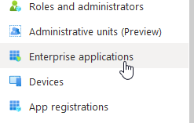

3. Click "New application"

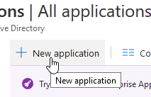


4. Pick "Non-gallery application"

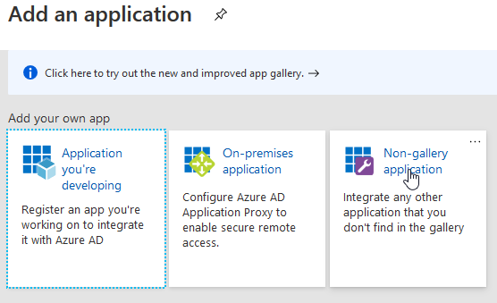

5. Pick a name and click "Add" on the bottom left of the page

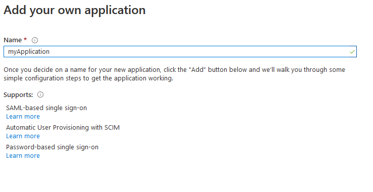

6. Go to users and groups

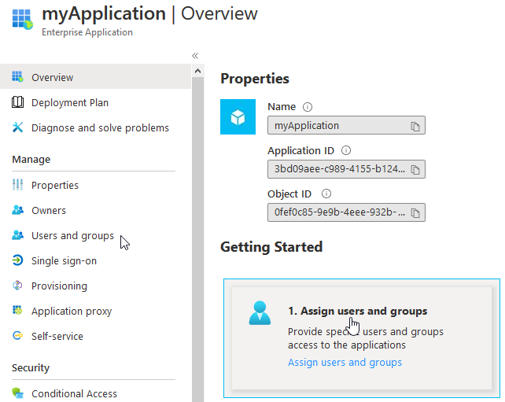

7. Click on "Add user"


## Configuring SP

1. Go to the "Single sign-on" page for your enterprise application


2. Pick "SAML"

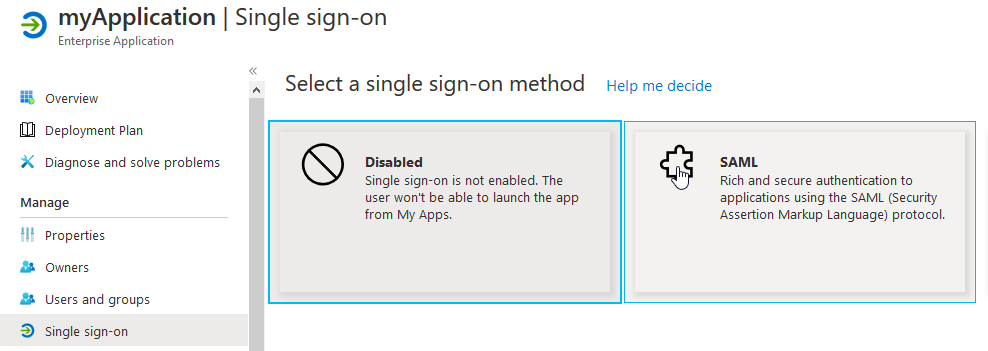

3. Download the azure metadata

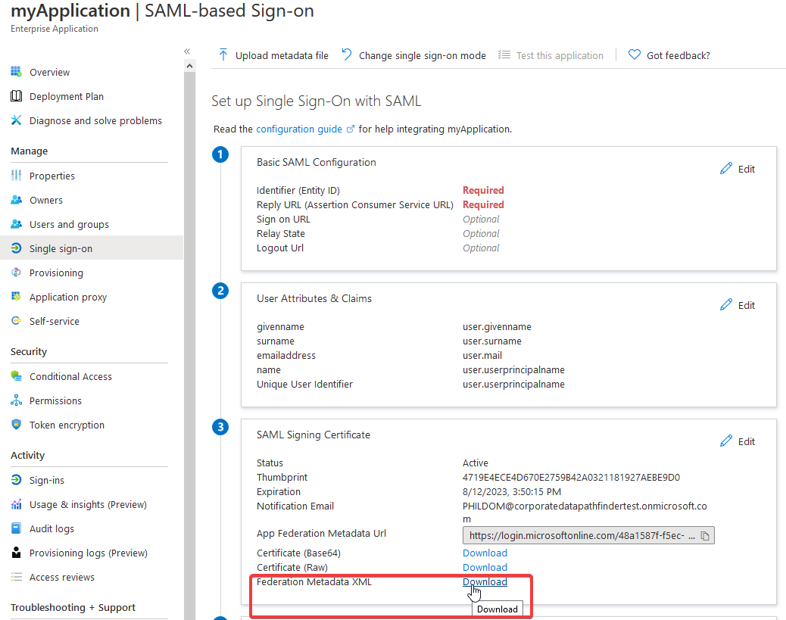

4. Replace the contents of [sp/etc-shibboleth/idp-metadata.xml](../sp/etc-shibboleth-idp.metadata.xml) with the downloaded metadata

5. Add the scope declaration to the idp metadata

Add the schema definition as an attribute of the `EntityDescriptor` tag


```xml
xmlns:shibmd="urn:mace:shibboleth:metadata:1.0"
```

Add the scope extension under the `IDPSSODescriptor` tag


```xml
		<Extensions>
			<shibmd:Scope regexp="false">034gc.onmicrosoft.com</shibmd:Scope>
		</Extensions>
```

## Configuring Azure

1. Go to the claims edit page


2. Add a new claim

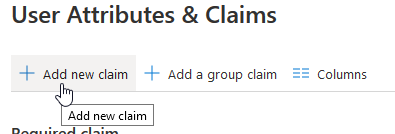

3. Configure the attributes of the claim

Name: `sAMAccountName`

Namespace: `http://schemas.xmlsoap.org/ws/2005/05/identity/claims`

Source attribute: `user.userprincipalname`

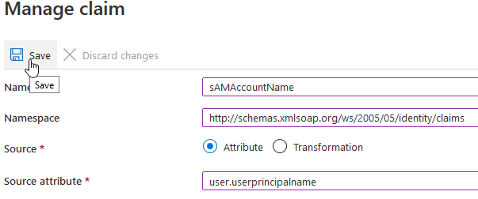

4. Start the SP and download the metadata from [http://idptestbed/Shibboleth.sso/Metadata](http://idptestbed/Shibboleth.sso/Metadata)

The SP can be started by running `docker-compose up --build`

5. Upload the downloaded metadata to azure


6. Save the default upload configuration

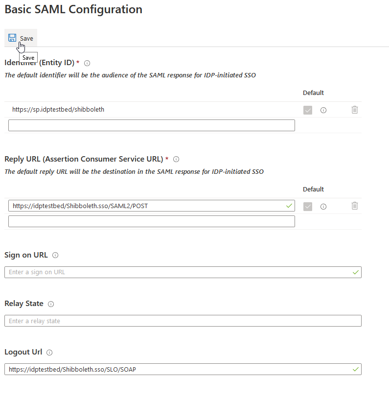

## Test the setup

1. Under the SAML Single Sign On settings for the enterprise application, scroll down and click "Test"


2. Test signing on as current user

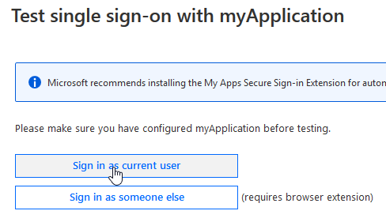